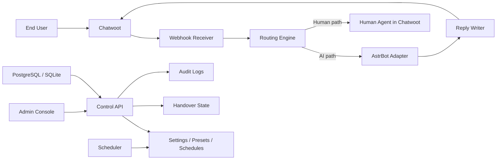

# HelixDesk AI

[English](README.md) | [绠€浣撲腑鏂嘳(README.zh-CN.md)

HelixDesk AI is a unified AI customer service platform that stitches together `Chatwoot` and `AstrBot` with an admin-controlled orchestration layer.

The goal is simple: keep `Chatwoot` as the customer support operating desk, keep `AstrBot` as the AI engine, and add a clean control plane in the middle so administrators can configure AI presets, schedule AI on/off windows, hand conversations over to humans, and restore AI automatically when needed.

## Why HelixDesk AI

Most teams do not need to rewrite their entire support stack just to add AI.

HelixDesk AI focuses on the missing middle layer:

- global AI enable / disable controls
- scheduled AI working hours
- automatic AI replies for inbound conversations
- human takeover and restore-to-AI flow
- preset-based AI behavior management
- Chatwoot webhook orchestration and reply delivery
- audit-friendly runtime state and admin settings

## Current Scope

This repository currently contains the first backend implementation for the orchestration layer.

Included today:

- `FastAPI` control API
- `SQLite / PostgreSQL` compatible persistence
- system settings, business hours, AI presets, conversation state, and audit logs
- Chatwoot webhook verification and reply delivery skeleton
- AstrBot adapter with configurable bridge endpoints
- smoke tests for routing, handover, and webhook validation

Planned next:

- real `admin-web` frontend
- richer AstrBot bridge implementation
- Chatwoot production integration hardening
- database migrations and deployment polish

## Architecture



## Repository Layout

```text
apps/
  control-api/   FastAPI orchestration backend
  admin-web/     Planned management frontend

deploy/
  compose/       Docker Compose definitions
  docker/        Container build files

scripts/
  dev.ps1        Local development entrypoint
```

## Quick Start

### Local development

```powershell
.\scripts\dev.ps1
```

Default local behavior:

- database: `sqlite:///./data/app.db`
- Chatwoot adapter: mock mode enabled
- AstrBot adapter: mock mode enabled

### Key endpoints

- `GET /api/admin/system-settings`
- `PUT /api/admin/system-settings`
- `GET /api/admin/business-hours`
- `POST /api/runtime/chatwoot/webhook`
- `POST /api/runtime/route-message`
- `GET /api/runtime/health`

## Product Positioning

HelixDesk AI is not trying to replace either Chatwoot or AstrBot.

Instead, it acts as a control plane between them:

- `Chatwoot` stays responsible for inboxes, conversations, agents, and support operations
- `AstrBot` stays responsible for AI generation, knowledge, and automation capabilities
- `HelixDesk AI` owns policy, routing, scheduling, handover, and admin controls

This makes the platform easier to evolve without deeply forking both upstream projects.

## Roadmap

### Phase 1: Foundation

- [x] control API skeleton
- [x] persistent settings and runtime state
- [x] webhook routing and mock AI replies
- [x] human handover and restore flow
- [x] public repository bootstrap

### Phase 2: Integration

- [ ] connect to live Chatwoot accounts and message events
- [ ] connect to a real AstrBot bridge endpoint
- [ ] add request signing, retries, and idempotency
- [ ] add migration management with Alembic

### Phase 3: Admin Experience

- [ ] build the standalone admin dashboard
- [ ] manage AI presets visually
- [ ] monitor runtime health and handover states
- [ ] inspect audit logs in the UI

### Phase 4: Production Readiness

- [ ] improve deployment and environment templates
- [ ] add Redis-backed runtime caching
- [ ] add observability and metrics
- [ ] add stronger operational safeguards for AI auto-replies

## Screenshot Plan

Screenshots are not included yet, but the repository is ready for them.

Recommended screenshot set:

1. Dashboard overview
2. Global AI switch and business hours
3. AI preset management
4. Conversation handover panel
5. Runtime health and audit log page
6. Chatwoot to AstrBot routing flow

Suggested storage and naming are documented in [docs/screenshots/README.md](docs/screenshots/README.md).

## Development Notes

- The backend is currently the main implementation target.
- External integrations default to mock mode for safer local development.
- The current live-repo upload used API-based publishing because direct `git push` from this environment was unstable.

## Repository

- Product name: `HelixDesk AI`
- Repository slug: `helixdesk-ai`
- Public repo: [https://github.com/GoSim7/helixdesk-ai](https://github.com/GoSim7/helixdesk-ai)
